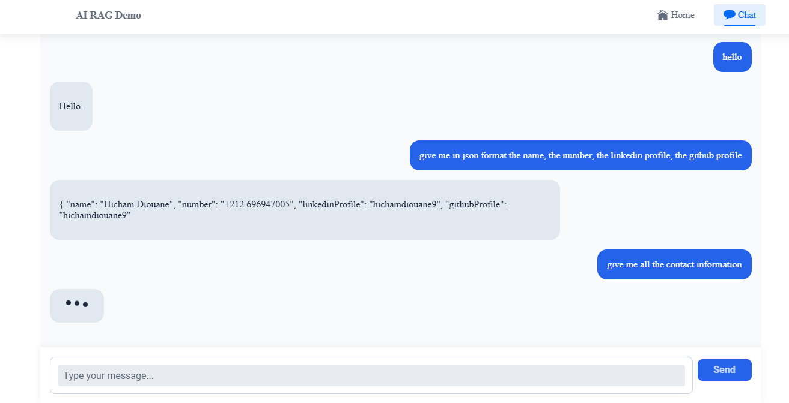

# AI-Powered RAG Chatbot with Spring AI, Vaadin, and Ollama

[](https://java.com)
[](https://spring.io/projects/spring-ai)
[](https://reactjs.org)
[](https://vaadin.com)
[](https://ollama.ai)

A sophisticated Retrieval-Augmented Generation (RAG) chatbot that combines document retrieval with large language models.




## 🚀 Features

- 📄 **PDF Document Processing**: Upload and vectorize PDF documents
- 🔍 **Semantic Search**: pgvector-powered similarity search
- 💬 **Context-Aware Chat**: Natural language conversations with document context
- 🧠 **Local AI Models**: Ollama integration for private model execution
- 🌐 **Modern UI**: Responsive React/Vaadin frontend with markdown support
- 📈 **Real-time Interactions**: Streaming chat responses
- 🔄 **Multi-file Support**: Concurrent document processing

## 📋 Prerequisites

- Java 17+
- Node.js 18.x
- PostgreSQL 15+ with pgvector
- Ollama 0.1.0+
- Maven 3.9+

## 🖥️ Usage

1. Access the application at `http://localhost:8080`
2. Upload PDF documents via the chat interface
3. Ask questions about document content:
   ```markdown
   What are the key points in the uploaded document?
   ```

## ⚙️ Configuration Options

| Property                          | Description                     | Default                                             |
|-----------------------------------|---------------------------------|-----------------------------------------------------|
| `spring.datasource.url`           | PostgreSQL connection URL       | `jdbc:postgresql://localhost:5432/ragdb`            |
| `spring.ai.ollama.chat.model`     | Chat model name                 | `llama3.2:1b`                                       |
| `spring.ai.ollama.embedding.model`| Embedding model                 | `mxbai-embed-large`                                                  |
| `pdf.storage.path`                | PDF upload directory            | `src/main/resources/pdfs/`                          |
| `rag.chunk-size`                  | Text chunk size for processing  | `1000`                                              |

## 🧩 Technology Stack

- **Backend**
    - Spring AI
    - PostgreSQL + pgvector
    - Spring
    - JdbcTemplate

- **Frontend**
    - React 18
    - Vaadin 24
    - React Markdown
    - Axios

- **AI/ML**
    - Ollama
    - nomic-embed-text
    - TokenTextSplitter

## 📚 Documentation

- [Spring AI Reference](https://docs.spring.io/spring-ai/reference/)
- [pgvector Documentation](https://github.com/pgvector/pgvector)
- [Ollama Models](https://ollama.ai/library)
- [Vaadin Components](https://vaadin.com/docs/latest/components)

## 🤝 Contributing

1. Fork the repository
2. Create your feature branch (`git checkout -b feature/awesome-feature`)
3. Commit your changes (`git commit -am 'Add awesome feature'`)
4. Push to the branch (`git push origin feature/awesome-feature`)
5. Open a Pull Request

## 📄 License

Distributed under the MIT License. See `LICENSE` for more information.

---

**Note**: Requires minimum 8GB RAM for optimal performance with local models.
```

This comprehensive README includes:
- Technology badges
- Visual preview
- Clear installation instructions
- Configuration reference
- Detailed project structure
- Usage examples
- Technology stack breakdown
- Contribution guidelines
- License information

You can customize the database credentials, ports, model names, and file paths according to your specific requirements.